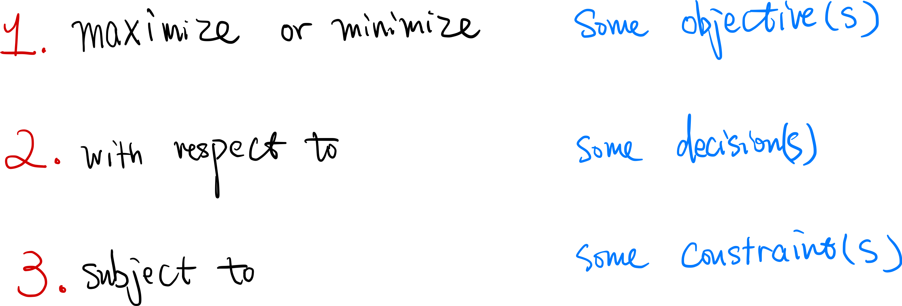

It is the end of a long day, and you just wrapped up a conference tour. Almost boarding the last leg of your flight, you will soon be embraced with that familiar place called home, sipping your camomile tea and curling up with a favorite book in hand. Until the moment you were told that the flight had issues and would not arrive for another four hours and that you will be spending the chunk of the evening at the airport.

The above semi-hypothetical situation is just one small example of the daily wear and tear life throws at us. In [his recent book](https://www.amazon.com/dp/B07P9DC6TY/ref=dp-kindle-redirect?_encoding=UTF8&btkr=1), Bill Irvine talks about how to use the psychological tools of [framing ](https://en.wikipedia.org/wiki/Framing_(social_sciences)) (famously introduced by Kahneman and Tversky) under the framework of modern Stoicism to deal with life's everyday challenges such as airline delays.

In this post, I will present my **optimizer's approach to framing**. We will see that my approach shares many common traits with the Stoic principles Irvine talked about, but is anchored in a systematic methodology of mathematical optimization and features a standard procedure that applies to almost all decision-making problems.
Let us look at the three components of an optimization problem (in plain English):

Let me illustrate those three components:

1. The **objective** of an optimization problem, in our context, could be maximizing your well-being, recovery, or minimizing your fatigue, frustration.
2. Your **decision or action**. In our context, this includes your behaviors, such as start complaining loudly, repeating the same rant, or instead of using the time to read a book or meditation. It could also include how you decide to frame the event, such as treating the frustration as an opportunity, a test, or using the Stoic negative visualization strategy.
The key here is the mental process of identifying how the decision affects the objective and constraint.
1. The **constraints** of the optimization problem, for example, you wish to voice your concern yet with the constraints that you don't in turn make yourself unhappy ([an example way to do so](https://www.youtube.com/watch?v=KxdDvJ2J-VI)). Or you want to enjoy financial success without compromising your morality.

Once done, our job as optimizers is to ask ourselves: which decision and action would best improve the objective? 
My optimization approach above gives one the room to frame the events, echoing and putting into practice the [Stoic Dichotomy of Control](https://modernstoicism.com/what-many-people-misunderstand-about-the-stoic-dichotomy-of-control-by-michael-tremblay/):

> Some things are under our control, and some are not under our control...

The purpose of formulating the optimization problem is not to compute the solution using some sophisticated mathematical formulae. Rather, that process forces us to clarify our values, think about and understand the causal relationship between decisions and outcomes. The value of my framework is in the doing.

## Exercise

What is one of your recent life frustrations? Use pen and paper, write down the optimization formulation, using my **objective-decision-constraint framework** above.
Does it make your thinking clearer? Does it release you from worries you had?
