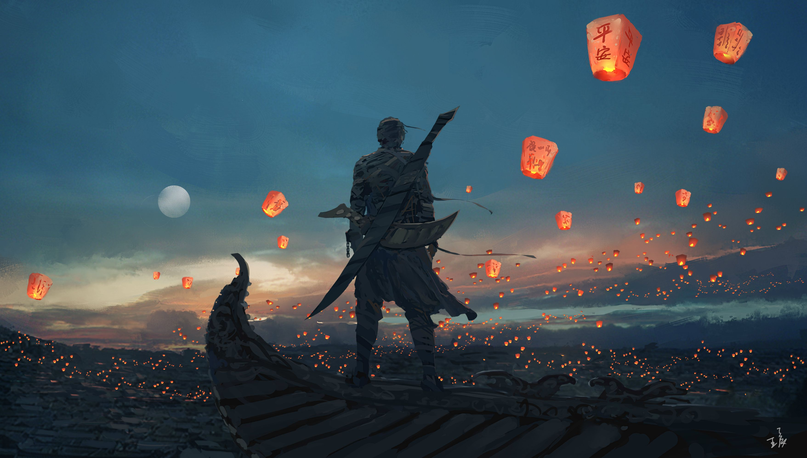

This page is dedicated to hosting all my unprofessional content, such as poetry & art.

### 麻塞諸塞的田野
二零一七年四月十六日

云端鷸的叫声和着青草的气味，融进手心泥土的触感  
天空残留的橘黄和蓝，渐被夜覆盖  
仿佛在记忆里十六岁时想象的未来中  
看不清你朦胧的脸颊，我望着远方  
听着听着，你的细语  

### 华山战记

二零一零年三月十五日

勇者齐格飞回到了帐篷  
想起了之前的历程  
刚才那少女的眸子  
清澈得不染颗粒风尘  
勇士暗忖着  
难道是那位古国的公主  

大抵在他这般二十二岁的年纪  
青年还都怀有浪漫  
我们的齐格弗里特  
决定带着三个随从  
翻过雪山  

早年深宫的瘴气怕是憋坏了青年们  
冰凉的山涧倒正是一味好药  
看呐，雪原上的松鼠跳着欢快的舞蹈  
欢迎踏着雪的好汉们  

不知多少年月之前  
异乡的召唤早已渗入齐格飞的心  
引着他去往座座高山  

今天离开驿站已经许久  
新套的马车也走到了尽头  
勇士们下马步行  
从当地人那知晓  
暴风雪将把这里覆盖  

愈走，愈险  
勇士的战意愈是高扬  
请听，俗世的怪响荡然无存  
留在心间的  
唯有搏动的心跳  
把青年们引近超越存在的神圣  

随从中一位来自东方的富贾  
不慎践踏妖精栖居的树根  
重重地倒在地上  
再未有醒来
他的幽魂化作一只野猫  
在每个深夜看着无依的旅人  

再来看看我们剩下的三位勇士  
随从的医师者背着重重的药箱  
步履蹒跚  
另一位，乃是楼市的账房  
穿着单薄  

是夜，三人把富贾的身子抬到龙曾经住过的山脊上  
埋进厚厚的雪堆  
但愿他的亡灵守护勇士们  
找到那失踪已久的楼兰之王  

三位朋友安葬了富贾  
投宿在了一家魔法师的小屋  
那魔法师乃是听从命令  
来送我们勇士的归西  

喝完酒之后  
三位勇士入眠了  

翌日，当齐格飞睁开眼之时  
身上的毯子都华作了冰雪  
那楼市的账房因穿的太少  
没能挺过那夜  
而那个医师学徒
因为脚上的洋葱大蒜而逃过一劫  
魔法师没有想到齐格飞  
我们的勇士不甘就此闭眼而死  
他拿出魔杖  
不料齐格拔出腰间的魔刀三刃木劈了他的双手  
埋了伙伴后，两个伤心的勇士继续上路  

在朝霞漫天的时候，他们来到了山顶  
望着天边  
他们忘记了此行的目的--追杀那楼兰的末代王  
一个慈祥的老者搀着随从向他们走来  
那善于社交的医师友善地向老人递过烟草  
突然那老人拔出一把匕首  
刺入了年轻医生的要害  
可怜的勇者齐格飞  
眼睁睁地看着自己三个伙伴惨死在茫茫雪山  
他咆哮起来  
用他树干一般的双臂将那阴险的老坏蛋举过头顶  
扔下了山崖  

那医师学徒已是没有救了  
老头的随从还在  
他压低着帽檐  

我们的勇士感到那冰凉的目光和泪水  
原来那就是楼兰公主  
让他一直念着不忘的少女  
老人便是他要刺的王  

勇士，你为何要将我的父亲推下山去  
你可知我那日见你便不再能思想其他  
夜里梦里都是你的姿态  
可你却偏偏是来追杀我父亲  
如今我爱你胜过爱我死去的父亲  
但我却不能随你回到你的家乡  
我生如朝露却羁绊无数  
话毕  
少女和她的眼泪一起飘下了山崖  

流浪,流浪  
千年幽梦随风去，不知家乡在何方  
勇士最后死在了去新大陆的船上  
带着亡友的恨和少女的眼神  
没有牵挂  
这倒是无法承受的轻
